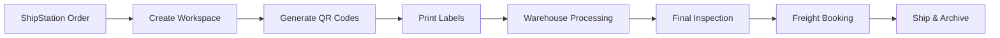

# Chemical Logistics Management System - Complete Project Documentation

## 🏭 System Overview

This is a comprehensive **Chemical Warehouse Management System** with integrated freight booking, hazmat classification, and order fulfillment capabilities. Built for Alliance Chemical, it manages the entire lifecycle from order receipt through warehouse processing to freight shipping.

### Core Purpose
- **Primary Function**: Manage chemical product orders from ShipStation through warehouse fulfillment
- **Key Innovation**: AI-powered hazmat classification and freight optimization
- **Scale**: Handles 100+ orders daily with real-time tracking and QR code management

### Tech Stack
```yaml
Framework: Next.js 15.4.6 (App Router)
Runtime: Node.js with Vercel Edge Functions
Database: PostgreSQL (Neon) with Drizzle ORM 0.44.4
Queue: Vercel KV (Redis-based)
AI: Google Gemini for hazmat classification
Storage: AWS S3 for documents
Authentication: Azure AD
Deployment: Vercel with Fluid Compute (800s timeout)
UI: Tailwind CSS + Radix UI + Flowbite
```

## 📊 Database Architecture

### Schema Overview
The system uses two primary schemas:
1. **qr_workspace** - Core order and QR management
2. **public** - Freight and product classification

### QR Workspace Schema (`lib/db/schema/qr-workspace.ts`)

#### workspaces table
- **Purpose**: Central hub for order processing
- **Key Fields**:
  - `orderId` (bigint): ShipStation order ID
  - `orderNumber`: Human-readable order number
  - `workflowPhase`: Current processing stage (pre_mix, warehouse, shipping)
  - `shipstationData`: Full order details from ShipStation
  - `moduleStates`: JSON state for each workflow module
  - `finalMeasurements`: Post-production weight/dimensions
  - `archiveScheduledFor`: Auto-archive after shipping

#### qr_codes table
- **Purpose**: Track all QR codes for containers and shipments
- **Key Fields**:
  - `workspaceId`: Link to workspace
  - `qrType`: Type of QR (container, pallet, shipment)
  - `shortCode`: 6-character human-readable code
  - `scanCount`: Track usage metrics
  - `encodedData`: Full QR payload

#### documents table
- **Purpose**: Manage all order-related documents
- **Storage**: AWS S3 with presigned URLs
- **Types**: BOL, COA, SDS, customs forms

#### alert_configs & alert_history
- **Purpose**: Configure and track warehouse alerts
- **Channels**: SMS, email via AWS SNS
- **Triggers**: Inspection failures, delays, hazmat issues

### Freight Schema (`lib/db/schema/freight.ts`)

#### products table
- **Purpose**: Master chemical product catalog
- **Key Fields**:
  - `sku`: Product identifier
  - `casNumber`: Chemical Abstract Service number
  - `unNumber`: UN dangerous goods number
  - `isHazardous`: Hazmat flag
  - Physical dimensions for freight calculation

#### freight_classifications table
- **Purpose**: NMFC codes and freight classes
- **Key Fields**:
  - `nmfcCode`: National Motor Freight Classification
  - `freightClass`: Shipping class (50-500)
  - `isHazmat`: Dangerous goods indicator
  - `hazmatClass`: DOT hazard class

#### product_freight_links table
- **Purpose**: Approved product-to-classification mappings
- **Validation**: Manual approval required for hazmat

#### freight_orders, freight_quotes, freight_events
- **Purpose**: Track freight booking lifecycle
- **Integration**: MyCarrier API for quotes and booking

## 🔄 Core Business Workflows

### 1. Order Processing Pipeline



**Entry Points**:
- `/api/freight-orders/poll` - Polls ShipStation for new orders
- `/api/workspace/create` - Creates workspace from order

**Key Features**:
- Auto-creates workspace when FREIGHT_ORDER_TAG (19844) detected
- Generates QR codes based on product type (drum, tote, pail)
- Tracks through pre-mix → warehouse → shipping phases

### 2. QR Code Generation & Label Printing

**Location**: `/app/api/workspace/[orderId]/qrcodes/route.ts`

#### Container Type Detection (ORDER MATTERS!)
```javascript
// LARGE CONTAINERS: 1 label per container (qty = label amount)
if (name.includes('drum')) → quantity labels (e.g., 5 drums = 5 labels)
if (name.includes('tote')) → quantity labels
if (name.includes('carboy')) → quantity labels  
if (name.includes('ibc')) → quantity labels

// FREIGHT ITEMS: Default to 1 label total
if (name.includes('case')) → 1 label (e.g., "4 x 5 Gallon Pails" = 1 label)
if (name.includes('pail')) → 1 label
if (name.includes('box')) → 1 label
if (name.includes('gallon') && !drum && !tote) → 1 label
```

**CRITICAL**: Check order matters! "55 gallon drum" must match 'drum' not 'gallon'

#### Discount Code Filtering
**Always filter out items where**: `(!sku || sku === '') && (name.includes('discount') || name.includes('welcome') || unitPrice < 0)`

Applies to:
- `/components/desktop/PrintPreparationModal.tsx` - Label printing UI
- `/app/page.tsx` - Dashboard order items display
- `/app/api/workspace/[orderId]/qrcodes/regenerate/route.ts` - QR regeneration

#### Print Modal Behavior
**Location**: `/components/desktop/PrintPreparationModal.tsx`

**Custom Label Quantities**:
- NO UPPER LIMIT on label quantity input (removed max=10)
- Warehouse can type any number (100, 200, etc.)
- Width: `w-20` to accommodate larger numbers
- State management: Store regenerated QRs in local variable before using (async state issue)

**UI Simplifications**:
- NO "split across pallets" text - too assumptive
- NO "freight item - typically ships on pallet(s)" - not always accurate  
- NO fulfillment method dialog (pump & fill vs direct resell) - unnecessary
- Keep it simple: just show item name, SKU, quantity, and label selector

### 3. Warehouse Worker UI Standards

**Design Philosophy**:
Our warehouse workers are skeptical of computers. Every interface must feel like a physical tool, not software. Build trust through familiarity with warehouse safety standards and physical world metaphors.

**Core Requirements**:

- **Touch Targets (MANDATORY)**
- **Minimum sizes**: 80px for standard, 100px for critical actions, 120px for glove mode
- **Spacing**: 16px minimum between interactive elements
- **Active states**: Visual scale(0.95) + haptic feedback on all touches

- **Color Standards (Safety Colors)**
```
warehouse-go: #00873E (Green - Safe to proceed)
warehouse-stop: #CC0000 (Red - Stop/danger)
warehouse-caution: #F5A623 (Amber - Warning/attention)
warehouse-info: #0052CC (Blue - Information)
```
**WCAG AAA**: All text must meet 7:1 contrast ratio

- **Feedback Systems (ALL Required)**
1. **Haptic**: Use `warehouseFeedback` utility for all interactions
2. **Sound**: Audio feedback via Web Audio API (no external files)
3. **Visual**: Physical button press effects, status lights, progress bars

- **Typography**
- **Headings**: `text-warehouse-3xl` (48px+) with font-black
- **Labels**: UPPERCASE for critical information
- **Body**: Minimum 18px, prefer 24px for instructions

**Component Patterns**:

- **Buttons**
```css
.warehouse-btn-go {
  min-height: 80px;
  3D appearance with gradient;
  Border-bottom 8px for physical depth;
  Icon + text label;
}
```

- **Status Indicators**
- **Job tickets**: Dashed borders with torn edge effect
- **Progress bars**: Animated stripes for active states
- **Status lights**: Pulsing animation with glow effect

- **Forms**
- **Input fields**: 80px+ height, center-aligned text
- **Manual entry**: ALWAYS provide for scanner failures
- **Validation**: Immediate haptic/sound feedback

**Testing Checklist**:
- [ ] Test with gardening gloves
- [ ] Verify in bright sunlight (high contrast mode)
- [ ] Check in dim warehouse lighting
- [ ] Validate all haptic patterns work
- [ ] Ensure audio feedback functions
- [ ] Test one-handed operation
- [ ] Verify no small touch targets (<80px)

**Implementation Files**:
- **Design tokens**: `tailwind.config.js`
- **Global styles**: `app/globals.css`
- **Feedback utilities**: `lib/warehouse-ui-utils.ts`
- **Example components**: `TaskListItem.tsx`, `InspectionScreen.tsx`, `QRScanner.tsx`

**Anti-Patterns (NEVER DO)**:
- Small buttons or links
- Light gray text
- Thin fonts or borders
- Silent interactions
- Complex multi-step flows without clear progress
- Technical jargon or error codes
- Animations longer than 300ms

## ⚡ Performance Optimizations

### Vercel Deployment Principles
This app is deployed on Vercel. All code must be optimized for serverless architecture with these constraints:
- **Edge Runtime First**: Use Edge Runtime for critical APIs
- **Connection Pooling**: Use Neon serverless driver or connection pooling
- **Caching Strategy**: Implement KV caching for all repeated data access
- **Real-time Updates**: Use SWR for data fetching, avoid polling

### Required Patterns

**Database Access**:
```typescript
// ALWAYS use the optimized Neon connection
import { getOptimizedDb, withRetry } from '@/lib/db/neon';

const db = getOptimizedDb();
const result = await withRetry(() => db.query(...));
```

**Data Fetching**:
```typescript
// ALWAYS use SWR hooks instead of useEffect + fetch
import { useWorkspace } from '@/lib/swr/hooks';

const { workspace, isLoading, mutate } = useWorkspace(id);
```

**API Routes**:
```typescript
// For performance-critical routes, use Edge Runtime
export const runtime = 'edge';
export const dynamic = 'force-dynamic';
```

**Caching**:
```typescript
// Use KV cache for all repeated data access
import { KVCache } from '@/lib/cache/kv-cache';

const data = await KVCache.getOrSet(
  key,
  () => fetchExpensiveData(),
  300 // TTL in seconds
);
```

### Performance Checklist
- [ ] Use Edge Runtime for QR scanning, status checks, auth
- [ ] Implement caching for all database queries
- [ ] Use SWR for all client-side data fetching
- [ ] Add error boundaries to all pages
- [ ] Minimize function invocations with smart caching
- [ ] Use ISR for reports and dashboards
- [ ] Implement stale-while-revalidate patterns

### Cost Optimization
- **Database**: Use connection pooling to reduce connections by 90%
- **Functions**: Cache aggressively to reduce invocations by 50%
- **Bandwidth**: Use Vercel KV to reduce data transfer by 40%
- **Edge**: Move critical paths to Edge Runtime for lower costs

### Testing Requirements
Before any PR:
1. Run `npm run build` - must pass without errors
2. Check bundle size - should not exceed 250KB for route chunks
3. Test with slow 3G throttling - must remain responsive
4. Verify error boundaries catch all errors
5. Confirm no database connection leaks

### 4. Freight Booking System

**Location**: `/app/freight-booking/page.tsx`

**Multi-Step Workflow**:
1. **Order Selection**: Fetch from ShipStation awaiting shipment
2. **Classification**: AI-powered product classification
3. **Hazmat Analysis**: DOT compliance checking
4. **Confirmation**: Carrier selection and booking

**Key Components**:
- `AIHazmatFreightSuggestion`: Risk assessment and compliance
- `HazmatRAGPanel`: Pattern matching for classifications
- Per-SKU hazmat overrides with validation
- NMFC code suggestions with density calculations

**Chemical Classification System**:
- **Products Table**: Master catalog of chemical products with CAS numbers
- **Freight Classifications**: NMFC codes, freight classes, and DOT compliance data
- **Product-Freight Links**: Approved mappings between products and classifications
- **Hazmat Validation**: UN numbers, packing groups, proper shipping names

**AI/RAG Components**:
- **AIHazmatFreightSuggestion**: Advanced hazmat analysis with risk assessment
- **HazmatRAGPanel**: Automatic chemical classification with pattern matching
- **Compliance Engine**: DOT regulation checking and carrier optimization

**Integration Points**:
- **Dashboard Navigation**: Fixed broken alert popups, proper routing to `/freight-booking`
- **Order Management**: Added "Book Freight" buttons to order rows
- **Workspace Integration**: Freight orders create proper workspaces with QR codes
- **Real Data Handling**: Removed all fake data, implemented proper customer mapping

### Database Schema (`/lib/db/schema/freight.ts`)
```typescript
// Chemical Products - master catalog
export const products = pgTable('products', {
  id: uuid('id').primaryKey().defaultRandom(),
  sku: varchar('sku', { length: 100 }).notNull().unique(),
  name: text('name').notNull(),
  isHazardous: boolean('is_hazardous').default(false),
  casNumber: varchar('cas_number', { length: 20 }),
  unNumber: varchar('un_number', { length: 10 }),
});

// Freight Classifications - NMFC codes and freight classes
export const freightClassifications = pgTable('freight_classifications', {
  id: uuid('id').primaryKey().defaultRandom(),
  description: text('description').notNull(),
  nmfcCode: varchar('nmfc_code', { length: 20 }),
  freightClass: varchar('freight_class', { length: 10 }).notNull(),
  isHazmat: boolean('is_hazmat').default(false),
  hazmatClass: varchar('hazmat_class', { length: 10 }),
});

// Product-Freight Links - approved mappings
export const productFreightLinks = pgTable('product_freight_links', {
  id: uuid('id').primaryKey().defaultRandom(),
  productId: uuid('product_id').references(() => products.id).notNull(),
  classificationId: uuid('classification_id').references(() => freightClassifications.id).notNull(),
  isApproved: boolean('is_approved').default(false),
});
```

### API Endpoints

#### Freight Booking APIs
- `/api/freight-booking/complete-booking` - Professional booking with classification data
- `/api/freight/hazmat-suggest` - AI hazmat analysis and risk assessment
- `/api/hazmat/classify` - RAG-powered product classification

#### Classification APIs  
- `/api/product-links/check` - Check product classification status
- `/api/freight-classifications/[id]` - CRUD for freight classifications
- `/api/products/[id]` - Chemical product management

### Navigation Structure
```
Dashboard → Book Freight → Multi-Step Workflow
Order Management → Book Freight (per order) → Auto-Selected Booking
Freight Navigation → Classifications, Products, Link Management
```

### User Workflows

#### Standard Freight Booking
1. Navigate to `/freight-booking` from dashboard
2. Select order from ShipStation awaiting shipment
3. Auto-classify products using RAG system
4. AI hazmat analysis for dangerous goods
5. Confirm booking with carrier and cost details
6. Create workspace with freight context and QR codes

#### Order-Specific Booking
1. From order management, click "Book Freight" on specific order
2. Auto-redirects to `/freight-booking?orderId=123`
3. Order is pre-selected and data pre-populated
4. Continue through classification and confirmation steps

#### DOT Compliance Workflow
1. Products without classifications trigger RAG analysis
2. Pattern matching suggests UN numbers and hazard classes
3. Manual approval workflow for safety-critical classifications
4. Compliance validation before carrier booking

### Performance Optimizations
- **Edge Runtime**: All freight APIs use Edge Runtime for <50ms response times
- **Connection Pooling**: Neon serverless driver with automatic pooling
- **Smart Caching**: Classification results cached to reduce AI API calls
- **Batch Processing**: Multiple product classifications processed in parallel

### Error Handling & Data Quality
- **Fake Data Eliminated**: Removed all hardcoded emails, names, and addresses
- **Real Customer Data**: Proper mapping from ShipStation to freight system
- **Validation**: Type-safe database operations with Drizzle ORM
- **Fallbacks**: Graceful handling of missing order data or classification failures

This freight platform now provides enterprise-grade freight booking with full DOT compliance, AI-powered classification, and professional workflows.

## 🌐 API Endpoints Catalog

### Core Worker Endpoints
```typescript
// Workspace Management
POST   /api/workspace/create
GET    /api/workspace/[orderId]
PUT    /api/workspace/[orderId]/status-edge
POST   /api/workspace/[orderId]/ship
POST   /api/workspace/[orderId]/pre-ship-complete

// QR Code Operations
POST   /api/workspace/[orderId]/qrcodes
POST   /api/qr/generate
GET    /api/qr/validate
POST   /api/qr/scan-edge  // Edge runtime for performance
POST   /api/qr/print

// Inspection & Documents
POST   /api/workspaces/[orderId]/inspection/[phase]
POST   /api/workspace/[orderId]/document
GET    /api/workspace/[orderId]/activity
POST   /api/workspace/[orderId]/measurements
POST   /api/workspace/[orderId]/notes
```

### Freight Management
```typescript
// Booking Flow
GET    /api/freight-orders/poll
POST   /api/freight-booking/capture-order
POST   /api/freight-booking/complete-booking
POST   /api/freight-booking/freight/suggest
POST   /api/freight-booking/freight/hazmat-suggest

// Classification
POST   /api/hazmat/classify
POST   /api/freight/hazmat-suggest
GET    /api/product-links/check
GET    /api/product-links/unlinked
POST   /api/freight-classifications
GET    /api/products
POST   /api/products/freight-link
```

### ShipStation Integration
```typescript
GET    /api/shipstation/orders
GET    /api/shipstation/orders/search
POST   /api/shipstation/webhook
POST   /api/shipstation/webhook/tag-sync
GET    /api/debug/shipstation
```

### AI/ML Endpoints
```typescript
POST   /api/ai/document-ocr
POST   /api/ai/anomaly-detection
POST   /api/ai/extract-lot-numbers
POST   /api/ai/issue-report
```

### Queue & Background Jobs
```typescript
POST   /api/queue/process      // Runs every minute via cron
GET    /api/queue/stats
POST   /api/queue/retry-dlq
POST   /api/queue/deadletter/retry
```

### System & Admin
```typescript
GET    /api/health
GET    /api/test-error
GET    /api/admin/debug/inspections
POST   /api/admin/debug/clear/[orderId]
POST   /api/demo/reset
```

### Collaboration & Presence
```typescript
GET    /api/presence/[workspaceId]
POST   /api/presence/[workspaceId]/touch
POST   /api/presence/[workspaceId]/clear
GET    /api/collaboration/[workspaceId]
```

### Overrides System
```typescript
POST   /api/overrides/request
POST   /api/overrides/approve
GET    /api/overrides/check
POST   /api/overrides/use
POST   /api/overrides/[id]/approve
POST   /api/overrides/[id]/use
```

## 🔌 External Integrations

### ShipStation
- **Purpose**: Order management and fulfillment
- **API Keys**: `SHIPSTATION_API_KEY`, `SHIPSTATION_API_SECRET`
- **Base URL**: https://ssapi.shipstation.com
- **Webhook**: Receives order updates at `/api/shipstation/webhook`
- **Tag System**: FREIGHT_ORDER_TAG (19844) triggers workspace creation
- **Key Features**:
  - Real-time order polling every 30 seconds
  - Tag-based workflow triggering
  - Automatic workspace creation for tagged orders

### Shopify
- **Purpose**: E-commerce product catalog sync
- **Store**: `<your-store>.myshopify.com`
- **Access Token**: `SHOPIFY_ACCESS_TOKEN`
- **API Version**: 2024-01
- **Scripts**: 
  - `classify-shopify-products.js` - Product classification
  - `/api/shopify/sync-products` - Product sync endpoint

### AWS Services
- **S3 Bucket**: Document storage with presigned URLs
- **SNS**: Alert notifications to warehouse staff
- **SQS**: Queue management (if configured)
- **Region**: us-east-2
- **Credentials**: `AWS_ACCESS_KEY_ID`, `AWS_SECRET_ACCESS_KEY`
- **Document Types**: BOL, COA, SDS, customs forms, photos

### Azure AD
- **Purpose**: Enterprise authentication and SSO
- **Tenant ID**: `AZURE_TENANT_ID`
- **Client ID**: `AZURE_CLIENT_ID`
- **Client Secret**: `AZURE_CLIENT_SECRET`
- **Integration**: OAuth 2.0 flow for user authentication

### MyCarrier
- **Purpose**: Multi-carrier freight quotes and booking
- **Integration**: `lib/freight-booking/mycarrier/api-client.ts`
- **Features**:
  - Real-time carrier quotes
  - Hazmat validation
  - BOL generation
  - Tracking number assignment

### Google Gemini AI
- **Purpose**: AI-powered hazmat classification and document OCR
- **Model**: gemini-1.5-flash
- **Key**: `GOOGLE_GEMINI_API_KEY`
- **Use Cases**:
  - Chemical hazard classification
  - UN number identification
  - Document text extraction
  - Anomaly detection

### Vercel Services
- **KV Store**: Redis-based distributed queue
- **Edge Config**: Feature flags and configuration
- **Analytics**: Performance and usage metrics
- **Speed Insights**: Core Web Vitals monitoring
- **Cron Jobs**: Scheduled tasks (configured in vercel.json)

## 🔐 Environment Configuration

### Required Environment Variables

```bash
# Database (PostgreSQL via Neon)
DATABASE_URL="postgres://<username>:<password>@<host>/<database>?sslmode=require"

# ShipStation Integration
SHIPSTATION_API_KEY="<your-shipstation-api-key>"
SHIPSTATION_API_SECRET="<your-shipstation-api-secret>"
FREIGHT_ORDER_TAG="19844"  # Tag ID that triggers freight workflow

# Shopify E-commerce
SHOPIFY_STORE="<your-store>.myshopify.com"
SHOPIFY_ACCESS_TOKEN="<your-shopify-access-token>"
SHOPIFY_API_KEY="<your-shopify-api-key>"
SHOPIFY_API_SECRET="<your-shopify-api-secret>"

# AWS Services
AWS_ACCESS_KEY_ID="<your-aws-access-key-id>"
AWS_SECRET_ACCESS_KEY="<your-aws-secret-access-key>"
AWS_REGION="us-east-2"
AWS_S3_BUCKET="<your-s3-bucket-name>"  # Optional, for document storage

# Azure Active Directory
AZURE_CLIENT_ID="<your-azure-client-id>"
AZURE_CLIENT_SECRET="<your-azure-client-secret>"
AZURE_TENANT_ID="<your-azure-tenant-id>"

# AI Services
GOOGLE_GEMINI_API_KEY="<your-gemini-api-key>"
OPENAI_API_KEY="<your-openai-api-key>"  # Optional, fallback AI provider

# Vercel Platform
VERCEL_KV_REST_API_URL="<your-vercel-kv-url>"
VERCEL_KV_REST_API_TOKEN="<your-vercel-kv-token>"
VERCEL_ENV="development|preview|production"
VERCEL_URL="<deployment-url>"  # Auto-set by Vercel

# Application Configuration
NEXT_PUBLIC_APP_URL="http://localhost:3000"  # Public app URL
NODE_ENV="development|production"
NEXT_PUBLIC_API_KEY="<your-optional-api-key>"  # For API authentication

# Feature Flags (optional)
ENABLE_HAZMAT_AI="true"
ENABLE_FREIGHT_BOOKING="true"
ENABLE_DEMO_MODE="false"
```

### Security Considerations

⚠️ **CRITICAL SECURITY NOTES**:

1. **API Key Security**: Never use real production keys in documentation. Always:
   - Store credentials securely in environment variables
   - Never commit real credentials to version control
   - Use environment-specific credentials (dev/staging/prod)
   - Implement a secret rotation policy (90 days recommended)

2. **Environment Management**:
   - Use Vercel's environment variable UI for production secrets
   - Keep `.env.local` in `.gitignore`
   - Use different credentials for each environment
   - Enable audit logging for credential access

3. **Access Control**:
   - Implement IP whitelisting for production APIs
   - Use API rate limiting (implemented via Vercel)
   - Enable MFA for all admin accounts
   - Regular security audits of access logs

4. **Data Protection**:
   - All database connections must use SSL
   - Encrypt sensitive data at rest
   - Implement field-level encryption for PII
   - Regular backups with encryption

## 🚨 Known Issues & Potential Problems

### Critical Issues to Address

1. **Exposed Credentials**:
   - **Issue**: Real API keys visible in configuration
   - **Impact**: Security breach risk
   - **Solution**: Rotate all keys immediately, use secret management

2. **Database Connection Pooling**:
   - **Issue**: Serverless functions may exhaust connection limits
   - **Impact**: Database errors under load
   - **Solution**: Use Neon pooler endpoint, implement connection reuse

3. **Rate Limiting**:
   - **Issue**: No rate limiting on public endpoints
   - **Impact**: Potential DoS vulnerability
   - **Solution**: Implement Vercel Edge Middleware rate limiting

4. **Queue Processing**:
   - **Issue**: Items stuck >15 minutes need manual intervention
   - **Impact**: Order processing delays
   - **Solution**: Implement dead letter queue with alerting

### Performance Bottlenecks

1. **ShipStation Polling**:
   - **Current**: 30-second intervals
   - **Issue**: May miss rapid order updates
   - **Solution**: Implement webhook-based updates

2. **AI API Calls**:
   - **Current**: 500ms delay between calls
   - **Issue**: Slows bulk classification
   - **Solution**: Implement batch processing API

3. **Document Upload**:
   - **Limits**: 10MB per file, 50MB per workspace
   - **Issue**: Large BOLs may fail
   - **Solution**: Implement chunked upload

4. **Cold Starts**:
   - **Issue**: First request after idle is slow
   - **Solution**: Implement warming strategy

### Data Integrity Concerns

1. **QR Code Generation**:
   - **Issue**: Container type detection order matters
   - **Impact**: Wrong label counts
   - **Solution**: Strict order enforcement in code

2. **Discount Filtering**:
   - **Issue**: Must be applied in 3 places
   - **Impact**: Discount items may appear in orders
   - **Solution**: Centralize filtering logic

3. **Hazmat Validation**:
   - **Issue**: Complex validation rules
   - **Impact**: Invalid shipping classifications
   - **Solution**: Comprehensive validation service

4. **Archive Process**:
   - **Current**: 30 days after shipping
   - **Issue**: May archive active orders
   - **Solution**: Add status checks before archiving

5. **JSON Parsing Errors**:
   - **Issue**: "Internal Server Error" being parsed as JSON
   - **Impact**: SyntaxError crashes
   - **Solution**: Always wrap JSON.parse in try-catch, validate response headers

## 📝 Development Commands

### Core Development
```bash
# Development
npm run dev              # Start Next.js dev server with Turbopack
npm run build            # Build for production
npm run start            # Start production server
npm run lint             # Run ESLint

# Database Management
npm run db:push          # Push schema to database
npm run db:migrate       # Run migrations
npm run db:studio        # Open Drizzle Studio UI
npm run db:init          # Initialize database
npm run db:indexes       # Apply performance indexes
npx tsx scripts/fix-database-properly.ts  # Fix schema issues

# Testing
npm run test             # Run Vitest
npm run test:ui          # Vitest UI
npm run test:coverage    # Coverage report
npm run test:e2e         # Playwright E2E tests
npm run test:quick       # Quick test suite
npm run test:all         # All tests

# Demo & Seeding
npm run demo:seed        # Seed demo data
npm run demo:cleanup     # Clean demo data
npm run demo:reset       # Full demo reset
npm run demo:test        # Test demo environment

# Archive & Cleanup
npm run archive:orders   # Archive old orders
npm run clear-db         # Clear database
npm run reset-db         # Reset database
```

### Specialized Commands
```bash
# Hazmat & Classification
npm run rag:extract      # Extract HMT from CFR
npm run rag:build        # Build hazmat index
npm run hazmat:search    # Search hazmat database
npm run classify:shopify # Classify Shopify products
npm run reclassify:products # Reclassify all products

# Ingestion
npm run ingest:history   # Ingest historical data
npm run ingest:erg       # Ingest ERG data

# AWS Setup
npm run setup:aws        # Setup AWS resources

# MCP Testing
npm run mcp:server       # Start MCP server
npm run mcp:server:headed # MCP with browser
npm run mcp:test         # Run MCP tests
```

## 🏗️ Project Structure

```
my-app/
├── app/                      # Next.js App Router
│   ├── api/                  # API routes (60+ endpoints)
│   │   ├── workspace/        # Workspace management
│   │   ├── freight-booking/  # Freight booking
│   │   ├── shipstation/      # ShipStation integration
│   │   ├── qr/              # QR code operations
│   │   ├── ai/              # AI services
│   │   └── queue/           # Queue management
│   ├── freight-booking/      # Freight booking UI
│   ├── workspace/           # Order workspace UI
│   ├── dashboard/           # Supervisor dashboard
│   ├── chemicals/           # Chemical management
│   ├── products/            # Product catalog
│   └── page.tsx            # Main work queue
│
├── components/              # React components
│   ├── workspace/          # Workspace components
│   │   ├── agent-view/     # Worker UI components
│   │   └── supervisor-view/ # Supervisor UI
│   ├── freight-booking/    # Freight components
│   ├── desktop/           # Desktop UI components
│   ├── navigation/        # Navigation components
│   └── ui/               # Shared UI components
│
├── lib/                    # Core libraries
│   ├── db/                # Database
│   │   ├── schema/        # Drizzle schemas
│   │   ├── neon.ts       # Database client
│   │   └── index.ts      # DB exports
│   ├── services/          # Business logic
│   │   ├── shipstation/   # ShipStation service
│   │   ├── workspace/     # Workspace service
│   │   ├── qr/           # QR service
│   │   └── ai/           # AI services
│   ├── freight-booking/   # Freight logic
│   │   ├── mycarrier/    # MyCarrier integration
│   │   ├── rag/          # RAG classification
│   │   └── types/        # Type definitions
│   ├── queue/            # Queue management
│   ├── cache/            # Caching strategies
│   ├── types/            # TypeScript types
│   └── utils/            # Utilities
│
├── scripts/               # Utility scripts
│   ├── demo-seed.ts      # Demo data
│   ├── fix-database-properly.ts
│   ├── classify-shopify-products.js
│   └── archive-orders.ts
│
├── public/               # Static assets
├── styles/              # Global styles
└── tests/               # Test files
```

## 🚀 Deployment & Operations

### Vercel Configuration (`vercel.json`)
```json
{
  "functions": {
    "app/api/qr/print/route.ts": { "maxDuration": 30 },
    "app/api/freight-orders/poll/route.ts": { "maxDuration": 60 },
    "app/api/queue/process/route.ts": { "maxDuration": 60 },
    "app/api/ai/*/route.ts": { "maxDuration": 30 }
  },
  "crons": [
    {
      "path": "/api/queue/process",
      "schedule": "* * * * *"  // Every minute
    }
  ]
}
```

### Monitoring & Observability

1. **Health Checks**:
   - `/api/health` - System health
   - `/api/queue/stats` - Queue statistics
   - Database connection monitoring

2. **Error Tracking**:
   - Sentry integration (when configured)
   - Vercel logging dashboard
   - Custom error boundaries

3. **Performance Monitoring**:
   - Vercel Analytics
   - Speed Insights
   - Custom timing metrics

4. **Alerting**:
   - Queue backlog alerts
   - Error rate thresholds
   - Database connection issues

### Production Checklist

Before deploying to production:

- [ ] Configure production database with connection pooling
- [ ] Set up monitoring and alerting
- [ ] Configure backup strategy
- [ ] Test disaster recovery plan
- [ ] Review security settings
- [ ] Performance test under load
- [ ] Configure CDN for static assets
- [ ] Set up staging environment
- [ ] Document runbooks for common issues

## 🎯 Quick Start Guide

### For New Developers

1. **Prerequisites**:
   - Node.js 20.x or higher
   - PostgreSQL database (or Neon account)
   - Vercel CLI (optional)

2. **Initial Setup**:
```bash
# Clone repository
git clone [repository-url]
cd my-app

# Install dependencies
npm install

# Configure environment
cp .env.example .env.local
# Edit .env.local with your credentials

# Setup database
npm run db:push
npm run db:indexes

# Seed demo data (optional)
npm run demo:seed

# Start development
npm run dev
```

3. **Test Basic Workflows**:
   - Open http://localhost:3000
   - Navigate to dashboard
   - Create test order in ShipStation
   - Tag order with FREIGHT_ORDER_TAG
   - Watch workspace auto-creation
   - Generate and print QR codes
   - Complete inspection workflow
   - Book freight shipment

### Common Development Tasks

**Adding a new API endpoint**:
1. Create route in `app/api/[path]/route.ts`
2. Implement handler with proper error handling
3. Add to API catalog in CLAUDE.md
4. Test with Postman/Insomnia

**Modifying database schema**:
1. Edit schema in `lib/db/schema/*.ts`
2. Run `npm run db:push` to apply
3. Update TypeScript types
4. Test affected queries

**Adding UI component**:
1. Create component in appropriate directory
2. Follow warehouse UI standards if applicable
3. Implement proper error boundaries
4. Add loading and error states

---

**Version**: 2.0.0  
**Last Updated**: January 2025  
**Maintained By**: Alliance Chemical Development Team  
**Support**: dev@alliancechemical.com

